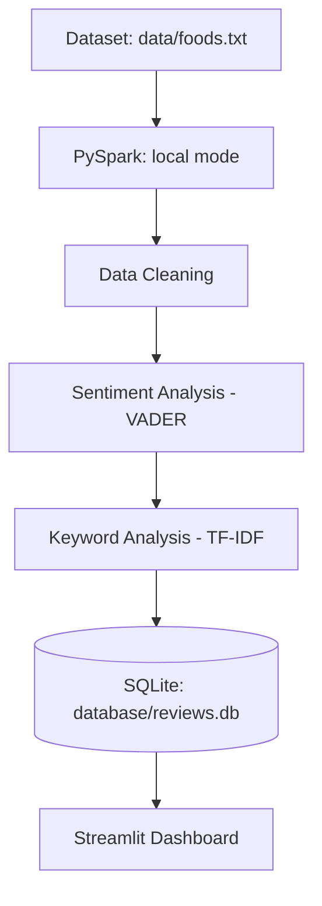

# E-Commerce Product Review Intelligence

Turning customer reviews into actionable business insights — fully local, no cloud, no API keys.

Repository: https://github.com/panubhav2001/ecommerce-review-intelligence

## Project Overview

Online retailers and product teams receive thousands of customer reviews, and manually reading through all of them to understand what customers like and dislike is impractical. Important signals — recurring complaints about delivery, praise for a particular feature, a product with unusually negative feedback — get lost in the noise.

This project builds a small, self-contained system that ingests raw product reviews and turns them into structured, queryable business intelligence: sentiment scores, keyword themes, product-level comparisons, and plain-language insights.

## Solution

The project is a local Python pipeline plus a Streamlit dashboard:

1. **Load** review data from the Amazon Fine Foods Reviews text file (the loader also supports CSV files with common review column names).
2. **Clean** the text and the underlying data (missing values, duplicates, normalization).
3. **Process at scale with PySpark**, demonstrating how the same cleaning and aggregation logic would scale to much larger datasets.
4. **Score sentiment** for every review using VADER, a local rule-based sentiment model (no API key, no internet required).
5. **Extract keywords** from positive and negative reviews using TF-IDF, surfacing what customers praise and complain about.
6. **Store** everything in a local SQLite database.
7. **Explore** the results interactively in a Streamlit dashboard with filters, charts, a searchable review explorer, and automatically generated business insights.

## Architecture



## Libraries and Technologies Used

### Runtime and data technologies

| Library or technology | What it does | Why it is used here |
|---|---|---|
| **Python 3.11+** | Runs the pipeline, analysis modules, database layer, and dashboard. | Provides one language across the complete application and has a strong data-analysis ecosystem. |
| **Pandas** (`pandas`) | Provides DataFrames for loading, transforming, filtering, grouping, and exporting tabular review data. | Handles flexible input schemas and review cleaning efficiently before and after Spark processing. |
| **Apache Spark** (`pyspark`) | Provides distributed DataFrame processing, null handling, de-duplication, and aggregations. | Demonstrates a scalable big-data processing approach while running locally with `local[*]`. |
| **Java Runtime** | Runs the Apache Spark engine. | PySpark requires a compatible Java runtime; Java 8, 11, 17, or 21 is supported by the project setup. |
| **VADER Sentiment** (`vaderSentiment`) | Calculates positive, neutral, negative, and compound sentiment scores from review text. | It is lightweight, works well for short informal text, and runs locally without an API key or model download. |
| **Scikit-learn** (`scikit-learn`) | Supplies `TfidfVectorizer` for term-frequency/inverse-document-frequency analysis. | Extracts distinctive positive and negative keywords without requiring an external language model. |
| **SQLite** (`sqlite3`) | Stores processed reviews and product summaries in a file-based relational database. | Requires no database server, is easy to inspect locally, and fits this self-contained project. |
| **Streamlit** (`streamlit`) | Serves the interactive web dashboard and its filters, tables, metrics, and visualizations. | Enables a usable local interface with minimal web application code. |
| **Plotly Express** (`plotly`) | Creates interactive bar and donut charts. | Makes ratings, sentiment, product comparisons, and keyword results easy to explore in the dashboard. |

### Python standard-library modules

| Module | What it does | Why it is used here |
|---|---|---|
| **`os`** | Handles filesystem paths and environment-level file operations. | Supports dataset and database file handling. |
| **`sys`** | Provides process-level controls such as clean exits and error reporting. | Lets the pipeline stop clearly when input data cannot be loaded. |
| **`time`** | Measures elapsed time. | Reports pipeline execution duration. |
| **`warnings`** | Controls Python warning output. | Keeps pipeline and dashboard output readable by suppressing non-actionable warnings. |
| **`random`** | Generates pseudo-random values. | Supports creation of synthetic sample reviews when the loader needs demonstration data. |
| **`datetime`** | Represents and formats dates and times. | Creates and normalizes review dates in generated and loaded data. |
| **`re`** | Performs regular-expression text processing. | Cleans review text and normalizes whitespace and unwanted characters. |
| **`html`** | Escapes and unescapes HTML entities. | Removes HTML markup artifacts from review text during preprocessing. |
| **`tempfile`** | Creates temporary files and directories. | Provides Spark with safe temporary working locations. |
| **`uuid`** | Generates universally unique identifiers. | Creates collision-resistant temporary paths for Spark processing. |

### Build and environment support

| Package or technology | What it does | Why it is used here |
|---|---|---|
| **`setuptools`** | Provides Python packaging and build support. | Keeps the dependency environment compatible with the project and PySpark tooling. |
| **`venv`** | Creates an isolated Python environment. | Prevents project dependencies from conflicting with system-wide packages. |

## Installation

### 1. Create a virtual environment

```bash
python -m venv .venv
```

### 2. Activate it (Windows)

```bash
.venv\Scripts\activate
```

On macOS/Linux, use `source .venv/bin/activate` instead.

### 3. Install dependencies

```bash
pip install -r requirements.txt
```

> **Note:** PySpark requires a Java runtime (Java 8, 11, 17, or 21) to be installed and on your `PATH`. Most systems already have this; if not, install a JDK (e.g. from [Adoptium](https://adoptium.net/)) before running the pipeline.

### 4. Add the dataset

Place the Amazon Fine Foods Reviews dataset at `data/foods.txt`. The dataset is intentionally not included in GitHub because it is approximately 354 MB. The expected format is the standard block-based format with fields such as `ProductId`, `ProfileName`, `Score`, `Time`, `Summary`, and `Text`.

Alternatively, update `DATA_PATH` in `pipeline.py` to point to a compatible CSV file.

### 5. Run the pipeline

```bash
python pipeline.py
```

This loads, cleans, and analyzes the review data, then saves the results into `database/reviews.db`.

### 6. Run the dashboard

```bash
streamlit run app.py
```

This opens the dashboard in your browser (usually at `http://localhost:8501`).

## Deploy on Streamlit Community Cloud

The app is ready to deploy from the GitHub repository:

1. Sign in at [share.streamlit.io](https://share.streamlit.io/) with GitHub.
2. Select **New app** and choose `panubhav2001/ecommerce-review-intelligence`.
3. Set the branch to `main` and the main file to `app.py`.
4. Select **Deploy**. No secrets or environment variables are required.

The generated SQLite database and large review datasets are excluded from GitHub. When the cloud app starts without `database/reviews.db`, it automatically runs the pipeline against the default sample input and creates a small demo database. For local analysis, keep your full dataset in `data/` and run `python pipeline.py` before starting Streamlit.

## Dataset

The default pipeline input is `data/foods.txt`, using the Amazon Fine Foods Reviews format. For a CSV input, update `DATA_PATH` in `pipeline.py` and place the file in `data/`. The loader flexibly maps several common column naming conventions to a standard internal schema:

| Standard column | Accepted variants (case-insensitive) |
|---|---|
| `product_id` | `product_id`, `ProductId`, `asin`, `id` |
| `product_name` | `product_name`, `ProductName`, `product`, `name` |
| `rating` | `rating`, `Score`, `stars`, `star_rating`, `overall` |
| `review_title` | `review_title`, `Summary`, `title`, `headline` |
| `review_text` | `review_text`, `Text`, `review`, `body`, `content` |
| `review_date` | `review_date`, `Time`, `date`, `timestamp` |

> **Note:** Input datasets and generated database files are excluded by `.gitignore`. Keep local datasets out of source control, especially large review exports.

## Features

- **KPI overview:** total reviews, average rating, % positive, % negative.
- **Rating distribution** bar chart.
- **Sentiment distribution** donut chart.
- **Sentiment by rating** stacked bar chart.
- **Product comparison** horizontal bar chart showing the top 15 products by average rating, review count, positive %, or negative %.
- **Top positive / negative keyword** charts (TF-IDF).
- **Sidebar filters:** product, rating, sentiment — all charts and tables update live.
- **Review Explorer:** full-text keyword search across reviews, with sentiment/rating filters applied.
- **Key Business Insights:** dynamically generated, data-driven summary statements (not hard-coded).
- Graceful handling of missing data, empty results, and database errors — no raw Python tracebacks shown to the user.

## Business Value

Review intelligence like this helps businesses:

- **Product improvement** — see which features drive complaints vs. praise, and prioritize fixes.
- **Customer experience** — spot recurring friction points (e.g., delivery, packaging) before they escalate.
- **Quality monitoring** — track sentiment and rating trends per product over time.
- **Identifying recurring complaints** — TF-IDF keyword extraction surfaces themes without reading every review.
- **Product comparison** — quickly see which products are outperforming or underperforming peers.
- **Marketing insights** — understand which product qualities resonate most with customers, to highlight in messaging.

## Limitations

- **VADER is a rule-based sentiment model.** It works well for short, informal review text but can misjudge sarcasm, nuanced context, or domain-specific jargon.
- **TF-IDF keyword analysis does not fully understand context** — it surfaces statistically important words, not verified causal relationships between a word and customer satisfaction.
- **Dataset quality affects insights.** Garbage in, garbage out — mislabeled ratings or spam reviews will skew the analysis.
- **Amazon scraping is not part of this project.** You must supply the Amazon Fine Foods Reviews text file or a compatible CSV dataset.
- **The local SQLite database is intended for a project/demo environment**, not high-concurrency production use.

## Future Improvements

The following are intentionally *not* implemented in this version, but would be natural next steps:

- Aspect-based sentiment analysis (sentiment per product feature, not just per review).
- Real-time review ingestion (e.g., a live feed instead of a static CSV).
- Support for larger, distributed datasets across an actual Spark cluster.
- Product recommendation based on review sentiment.
- LLM-based review summarization.
- Cloud deployment of the dashboard.

## Project Structure

```text
ecommerce-review-intelligence/
│
├── data/
│   └── foods.txt              # local Amazon Fine Foods Reviews dataset (not tracked)
│
├── database/
│   └── reviews.db             # created by pipeline.py
│
├── src/
│   ├── __init__.py
│   ├── data_loader.py         # CSV loading + flexible column mapping + sample data
│   ├── preprocessing.py       # text cleaning
│   ├── spark_processing.py    # PySpark cleaning + summary statistics
│   ├── sentiment.py           # VADER sentiment scoring
│   ├── keyword_analysis.py    # TF-IDF keyword extraction
│   ├── insights.py            # rule-based business insight generation
│   └── database.py            # SQLite read/write
│
├── app.py                     # Streamlit dashboard
├── pipeline.py                # end-to-end processing pipeline (run this first)
├── requirements.txt
├── README.md
└── .gitignore
```
